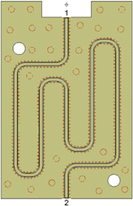
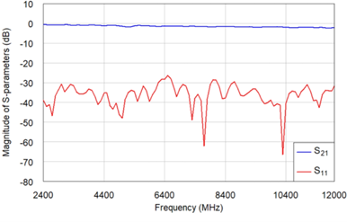
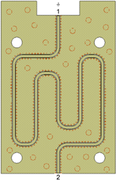
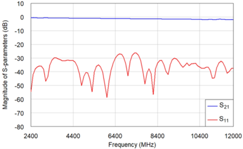
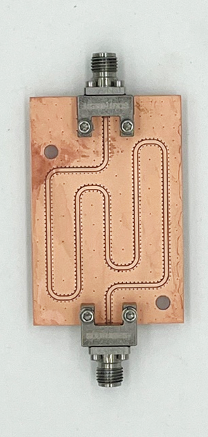
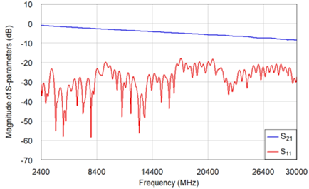
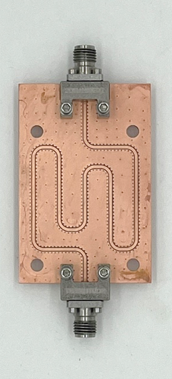
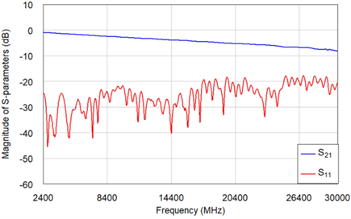
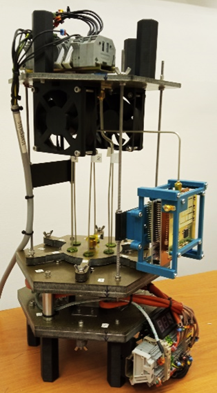
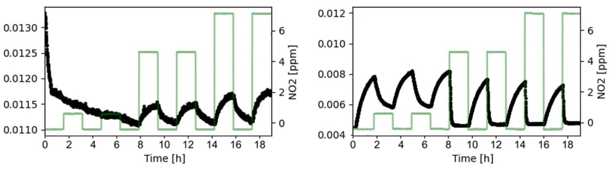

# Design of a microwave sensor for application in gas concentration measurements 
This is a project completed as part of my engineering thesis. A microwave sensor sensitive to low concentrations of gases was developed. It was designed using CPW (coplanar waveguide) technology.

## Project Report
### Electronics and Telecommunications - Bachelor's thesis
### Author: Damian Machnik
### Date: 22th December 2024

## Table of contents
1. [Project Description and Objectives](#project-description-and-objectives)
   
   1.1. [Project Goal](#project-goal)
   
   1.2. [Application](#application)
   
   1.3. [Project Assumptions](#project-assumptions)
   
   1.4. [Symulation environment](#symulation-environment)
   
   1.5. [Conducted studies](#conducted-studies)
   
2. [Project results](#project-results)
   
   2.1. [S-parameters simulation results](#s-parameters-simulation-results)
   
   2.2. [S-parameters results from the fabricated device](#s-parameters-results-from-the-fabricated-device)
   
   2.3. [Gas station results](#gas-station-results)
   
3. [Summary](#summary)
   
  
## Project description and objectives

### Project goal
The aim of the thesis was to conduct comprehensive research on coplanar lines and, based on the results, to design a microwave sensor with the highest possible sensitivity to the presence of selected gases in the air.
Such a sensor should exhibit high transmission parameters, low reflection parameters, maximum possible length, and a wide bandwidth. Creating such a sensor required performing a series of electromagnetic simulations, which made it possible to determine the appropriate dimensions, shapes, and layout of the lines and vias of the sensor.
As a result, several sensor designs were proposed, based on which a printed circuit board was fabricated. The sensor’s characteristics were measured using a vector network analyzer. After being coated with a thin active layer that changes its electric permittivity upon exposure to the target gas, the sensor was subsequently used in a setup for measuring gas concentrations in the air.

### Application
There are many applications for this type of sensors, ranging from environmental monitoring, through industrial uses, to medical applications such as the analysis of exhaled breath. Microwave sensors are inexpensive to manufacture, have high sensitivity, and low energy consumption.

### Project assumptions
The sensor was fabricated on Rogers RO4003C laminate (εr = 3.38, tanδ = 0.003), with a substrate thickness of 0.51 mm and copper thickness of 17.5 μm, due to its stable dielectric parameters as a function of frequency and mechanical strength. This substrate thickness ensures minimal influence of the bottom ground plane on the central conductor, allowing the electric field to be almost entirely confined within the gaps.
The sensor has predefined dimensions of 52 mm by 34.5 mm due to the chamber in the measurement setup. To maximize the sensor’s sensitivity, it is important to maintain the longest possible transmission line within the limited area. A series of studies were conducted to create a long line that maintains a reflection coefficient matching of no worse than -20 dB over the frequency range from 2.4 GHz to 12 GHz. During the studies, care was also taken to ensure that the sensor components have dimensions that allow fabrication not only using the laser available at the AGH University laboratory but also by various companies, making the production repeatable.
The thin active layer is based on metal oxides such as CuO, SnO₂, TiO₂, or ZnO. It responds to volatile compounds such as nitrogen dioxide.

### Symulation environment 
The research, simulations, and designs were carried out using the “AWR Design Environment 17” software, in the “AXIEM – Async” simulator, which enables 2.5D field simulations. This simulator is optimized for designing planar structures such as CPW (Coplanar Waveguide).

### Conducted studies
The scope of the study included the analysis of the reflection coefficient of a section of the coplanar transmission line with respect to variations in:
 - the width of the signal line and the gap
 - the spacing between vias
 - the distance of the vias from the gap
 - the diameter of the vias
 - and the meandering of the line.
Thanks to the simulations performed and the collected data, it was possible to propose a sensor design. The gathered data can also serve as a foundation for future projects based on coplanar lines.

## Project results
Two sensor designs were created — one with two mounting holes and another with four.

### S parameters simulation results
Thanks to comprehensive research, in the simulations, the sensors exhibit satisfactory reflection and transmission parameters, as well as a length that ensures sufficient sensitivity even to small changes in gas concentration in the air.

Sensor with two mounting hole:

Sensor with four mounting hole:

### S parameters results from the fabricated device
The S-parameter characteristics of the physical microwave sensor are satisfactory and meet the design requirements. The reflection parameters of both sensors do not exceed –20 dB within the frequency range of 2.4 GHz to 12 GHz. Beyond this frequency range, the sensors still maintain very good impedance matching.
The expected degradation of the reflection characteristics of the physical sensor compared to the simulation was observed. This is due to the idealization of the sensor's parameters and components by the simulation software in order to speed up the simulation process. Additionally, minor imperfections in the fabricated sensor may also affect the reflection characteristics.
Sensor with two mounting hole:

Sensor with four mounting hole:

### Gas station results
A thin layer of copper oxide or tin oxide was applied to the sensors, depending on the variant. This treatment allows the sensor to respond to low concentrations of nitrogen dioxide, which is present in polluted air, such as smog. The sensors with the applied layers were installed in the measurement system. 
Nitrogen dioxide at various concentrations was introduced into the system alternately with clean synthetic air. The substance was changed every 90 minutes. This interval allows the sensor to reach a steady response to the gas and provides enough time for the sensor to regenerate before the next exposure.
The purpose of the measurements in the test system was not to determine the exact response of the sensor, but rather to observe whether and how the sensor reacts to the presence of low concentrations of the target gas. Therefore, the obtained values are relative and not scaled to absolute units.

## Summary
The microwave sensor was implemented as a section of a meandered coplanar waveguide. Such sensors are characterized by low production cost, high sensitivity, and low energy consumption. The construction of the coplanar line causes most of the electric field to be confined within the gaps. A thin layer that changes its electric permittivity upon contact with the target gas is applied to the sensor. Changes in the electrical properties of this layer within the gaps affect the sensor’s overall electrical parameters. The reflection coefficient of the sensor is measured over a wide frequency band and is used to extract the system’s response to the gas.
Thorough studies of the signal line, gaps, and vias allowed the determination of dimensions that enable the creation of a sensor with optimal parameters for detecting selected gases in the air. These studies can also be used in future work on coplanar lines.
The sensor met the design requirements while not posing fabrication difficulties. It has a wide bandwidth, from 2.4 GHz up to 30 GHz, and appropriate matching within this range. During testing, the sensor demonstrated high sensitivity to low concentrations of the target gas. This is due to the meander design, which effectively utilizes the sensor’s surface by creating a sufficiently long signal line and maximizing the gap areas.
In the future, more detailed studies and analyses will allow for more precise determination of gas concentrations in the air using the designed sensor, enabling its successful application in many fields.

